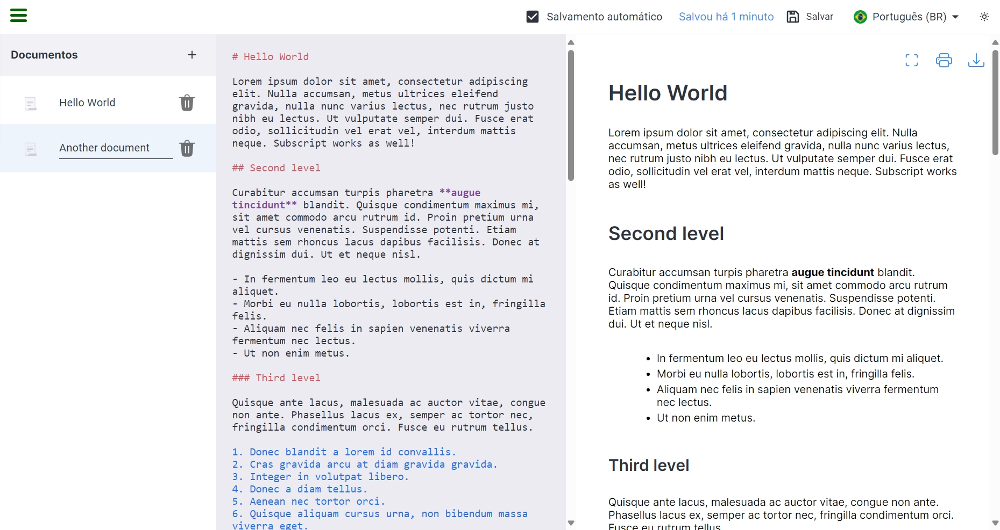

<h1 align="center">
    <br />
    <a href="https://markdown-previewer-d723b.web.app">
        
    </a>
    <br />
    Markdown Previewer
    <br />
</h1>

<h4 align="center">
    A minimal Markdown Editor web app built for those on a hurry
</h4>

<p align="center">
    <a href="#about-the-project">About the Project</a> •
    <a href="#key-features">Key Features</a> •
    <a href="#website">Website</a> •
    <a href="#technologies-used">Technologies Used</a> •
    <a href="#how-to-use">How To Use</a> •
    <a href="#how-to-install">How To Install</a> •
    <a href="#contributing">Contributing</a> •
    <a href="#credits">Credits</a> 
</p>

[](./public/videos/screen-capture.webm)

## About the Project

Welcome to the Markdown Previewer project! This project was created as part of the Front End Development Libraries certification on freeCodeCamp. It allows you to preview your Markdown in real-time, with additional features like internationalization, light and dark themes, markdown syntax highlighting, the ability to save your markdown files, and conversion of markdown to PDF or HTML.

## Key Features

-   Real-time Markdown preview
-   Internationalization support
-   Light and dark theme options
-   Markdown syntax highlighting
-   Save your markdown files
-   Convert markdown to PDF or HTML
-   GitHub Flavored Markdown
-   Syntax highlighting
-   Full screen mode
-   Autosave

## Website

Website URL: https://markdown-previewer-d723b.web.app

## Technologies Used

-   TypeScript
-   React
-   SASS

## How To Use

1. Enter your Markdown text in the editor area.
2. The preview area will update in real-time to display the formatted Markdown.
3. Use the toggle buttons to switch between light and dark themes.
4. Click the save button to save your Markdown file.
5. Use the export buttons to convert Markdown to PDF or HTML.

## How To Install

Follow these steps to get started with the Markdown Previewer project:

1. Clone the repository to your local machine:

```bash
git clone https://github.com/lipe-alves/markdown-previewer.git
```

2. Install dependencies:

```bash
npm install
```

3. Run the project:

```bash
npm run start
```

4. Open your browser and navigate to `http://localhost:3000` to view the Markdown Previewer.

## Contributing

Contributions are welcome! If you'd like to contribute to this project, please follow these steps:

1. Fork the repository.
2. Create a new branch for your feature or bug fix: `git checkout -b feature-name`.
3. Make your changes and commit them: `git commit -m 'Add new feature'`.
4. Push to the branch: `git push origin feature-name`.
5. Submit a pull request.

## Credits

This project was created by Felipe Alves (me!). Special thanks to freeCodeCamp for the Front End Development Libraries certification curriculum.

---

Thank you for using the Markdown Previewer project! If you have any questions or feedback, feel free to reach out. Happy coding!
